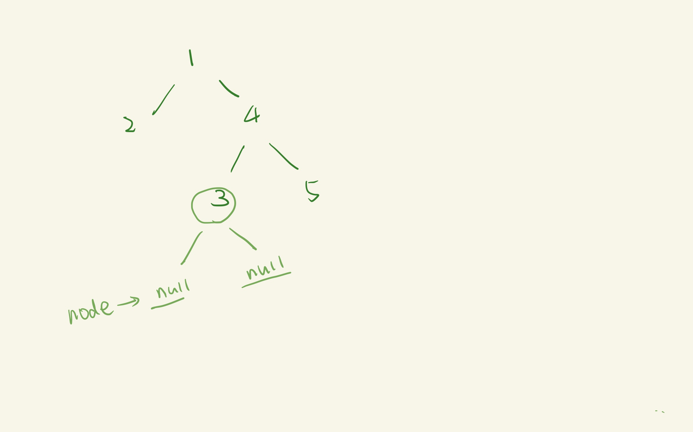

## recursion
**做[530](https://leetcode.com/problems/minimum-absolute-difference-in-bst/)的感悟**

### 递归的三个要素：
- 大问题可不可以分成若干个子问题
- 子问题和大问题的解题逻辑是否一致
- 递归的终止条件是什么


**下面是两个用不同的递归方式计算所有结点的和的例子**
#### Ex1

``` java

    Class Solution{
         int sum = 0;
      public int sumValue(TreeNode root){
        if(root == null) return 0;
        inOrder(root);
        return sum;
        }
      public void inOrder(TreeNode node){
        if( node == null) return;
        sum += node.val;
        inOrder(node.left);
        inOrder(node.right);
        }
    }
 
```

inOrder 这个方法其实并没有返回任何值，它只是按先序遍历的顺序遍历了一棵树，在递归的过程中，实例变量sum的值在不断的变化；


#### Ex2

```java 

    Class Solution{
        public int sumValue(TreeNode root){
        if( root == null) return 0;
        int sum = root.val + sumValue(root.left) + sumValue(root.right);
        return sum;
        // or
         return root.val + sumValue(root.left) + sumValue(root.right);
        }
    }

```
 叶子结点的左右子结点都为null，这时以叶子结点为根的子树的sum其实就是叶子结点的值，`if( root == null) return 0;` 这个返回值就派上了用场。

