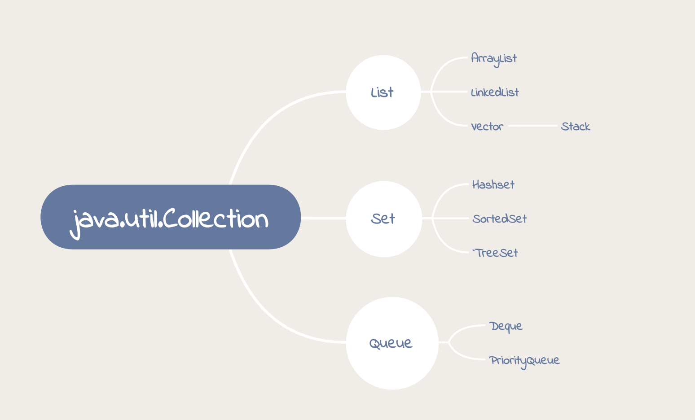
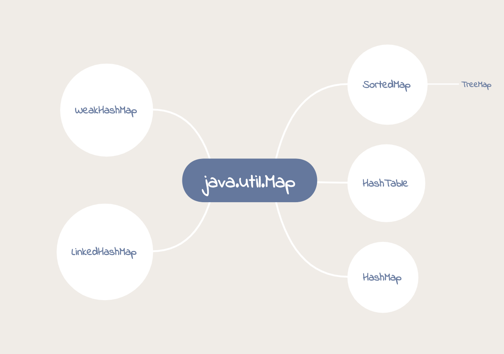

# Note

## Java 集合框架的基本 接口/类 层次结构





## Array

```java
int[] array = new int[10]; //intiate

array[0] = 5; // set

int a = array[2]; // get

int length = array.length; //length of the array

```

## LinkedList

```java
LinkedList<String> list = new LinkedList<>(); // initiate

list.add("add"); //add

list.set(0,"s"); //set, insert at the beginning

String s = list.get(0) //get

list.contains("s"); //search

list.remove("s"); //delete

```
## queue

在java里，linkedlist实现了Deque,可以做双向队列。

```java
Deque<Integer> queue = new LinkedList<>();

queue.add(122); //add, will throw exception when sth wrong

queue.offer(122);//add, will return false when sth wrong

int head = queue.poll();  //return first element and remove it (throw exception)

head = queue.remove(); //return the first element and remove it (return false)

head = queue.peek(); // return the first element

head = queue.element(); //return the first element

```

## Stack

用Deque来实现栈

```java
Deque<Integer> stack = new ArrayDeque<Integer>(); //initiate

stack.push(12);// add from the end 

int tail = stack.pop();// remove from the end, and delete this element

tail = stack.peek(); // remove from the end

```

## Set

```java
Hashset<Integer> hashset = new Hashset<>(); //initiate

hashset.add(12);// add

hashset.contains(11);// check if it contains

hashset.size(); //return the size of the set

hashset.isEmpty();// return true/false
```

## HashMap

```java
HashMap<Integer,String> hashmap = new HashMap<>(); //initiate

hashmap.put(1,"add"); //add

hashmap.get(1); //get

hashmap.size(); //size of the map
```

