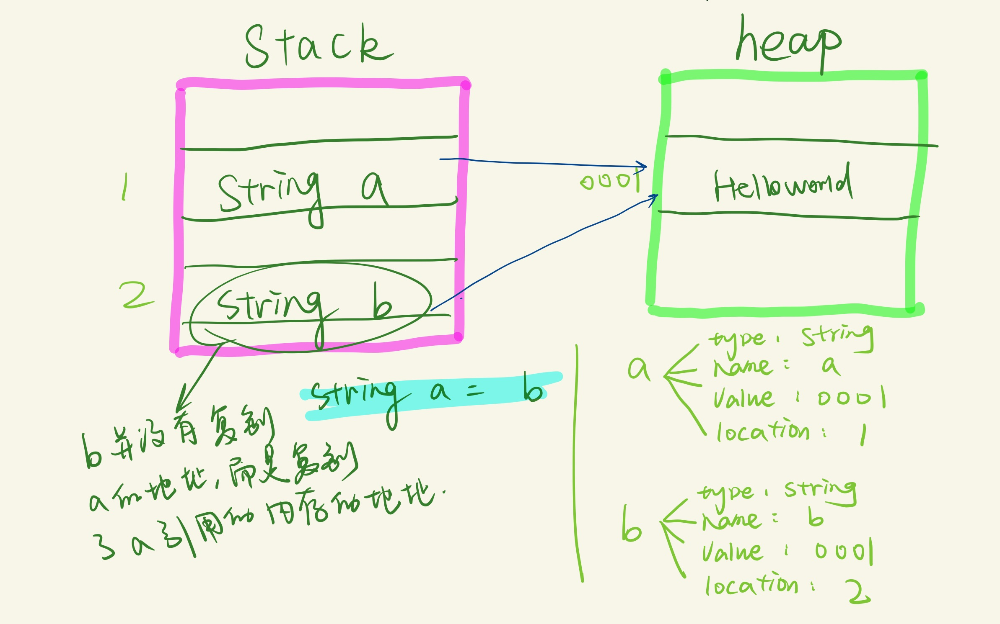

## 变量/对象/引用

## 变量的四个元素：type; name; value; location;
## stack/heap/变量/引用




## java的8个primitives 复制的不是地址，而是复制了整个对象； e.g.:
``` java
    int a = 5;
    int b = a;//这个变量b是直接存了a变量的值，即直接复制了5，并不是指向了a的5的地址
```

```python
#一个python的例子
def func2(a):
    a[0] = 2

def func():
    a = [1]
    func2(a)

    print(a)

func()
# 2
-------分割线-------

def func2(a):
    a = 2

def func():
    a = 1
    func2(a)
    print(a)

func()
# 1


```