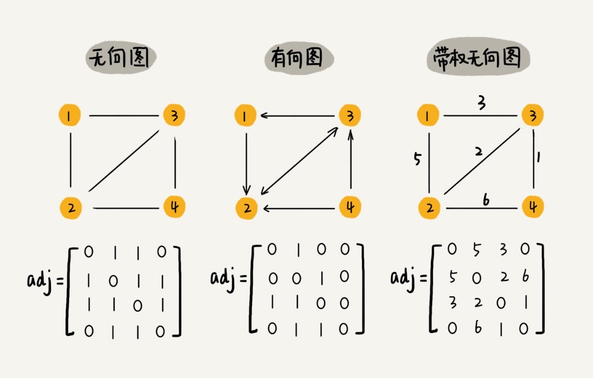
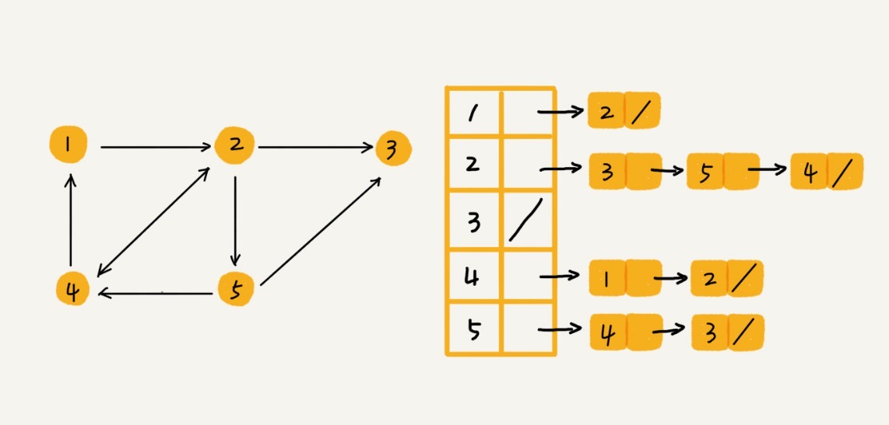

## 图

### 概念：

- 非线性表数据结构
- 树中的元素叫做**顶点(vertex)**
- 图中的一个顶点可以与任意其他的顶点建立连接关系，建立的关系叫做**边(edge)**
- 跟顶点相连接的边的条数叫做**度(degree)**
- 边有方向的图叫做**有向图**，边没有方向的图叫做**无向图**
- 顶点的**入度(In-Degree)**，表示有多少条边指向这个顶点
- 顶点的**出度(Out-Degree)**,表示有多少条边是以这个顶点作为出发点指向其他顶点
- **带权图(weigthed graph)**， 每条边都有一个权重**(weight)**

### 图最直观的一种存储方式：邻接矩阵(Adjacency Matrix)

- 邻接矩阵的底层依赖一个二维数组
- 虽然邻接矩阵表示图很直观，但是比较浪费存储空间（比如在无向图中，A[i]\[j\]等于1,那么A\[j\][i]肯定也是1，我们只需要存储一个就行。所有表示无向图的矩阵有一半都是浪费的）（又比如，我们存储的是***稀疏图(Sparse Matrix)**，顶点很多，但每个顶点的边不多，那么邻接矩阵的存储方法就更浪费空间了）
- 邻接矩阵的优点：1. 获取两个顶点的关系时很高效 2. 方便计算（求解最短路径问题涉及到的Floyd-warshall算法就是利用矩阵循环相乘数次得到结果）

### 邻接表存储方法(Adjacency List)

- 每个顶点对应一条链表，链表中存储的是与这个顶点相连接的其他顶点
- 相较于邻接矩阵，邻接表空间复杂度低， 但时间复杂度高

